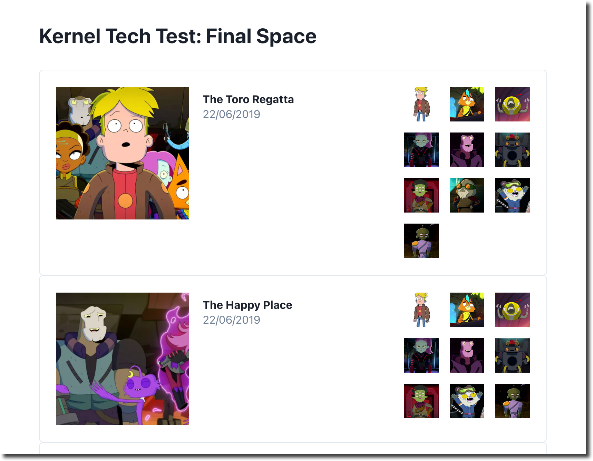

# 🌽 Kernel Technical Test

 - [Requirements](https://usekernel.notion.site/Kernel-Technical-Test-e9ce4823f8d44eef83e90d74597fb246)
 - Deplayed app: https://stalwart-pasca-68795e.netlify.app/

## Built with
- [Final Space API](https://finalspaceapi.com/) - a RESTful API based on the animated television show Final Space
- TypeScript – For project type-safety
- [TanStack Query](https://tanstack.com/query/v4/docs/react/overview) - For ....
- [Chakra UI](https://chakra-ui.com/) - A simple Component Library that works well with React


## To run
Clone down this repo and run a preview of the built app:
```
npm run preview
```
## Screenshot


## Approach

Given the time constraints I tried to approach the task with simplicity in mind whilst offering a functional, performant and 

Vite....
Chakra...

I read the docs on the First Space API and also tested the endpoints in Postman. I noticed that the payloads from the responses were pretty minimal

Testing for this scenario was manual given the time constraints. Typically I would add unit (Jest and/or RTL), integration and e2e testing (Cypress).

I also tested cross browser (Chrome, Safari and Firefox).
